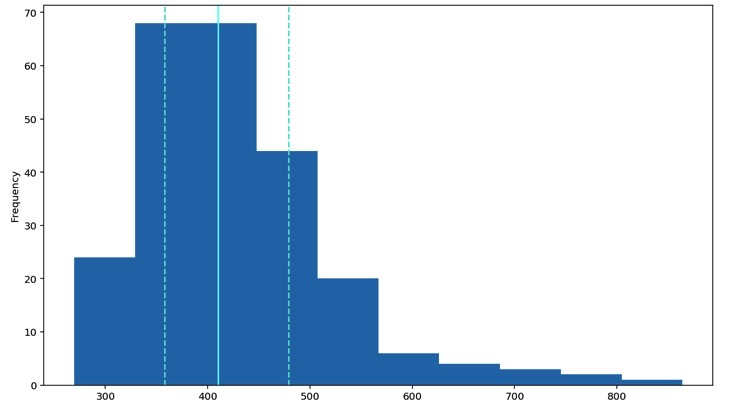

<a href="https://mayadickson.github.io/Portfolio/">Home</a>


# Exploratory Data Analysis
## Examining RT Distrubution
*This code creates a histogram based on the reaction times of a single subject, across 48 trials, in a flanker-Simon study.*


This sample shows how to make a histogram based on the original reaction time (rt) of the subject. 

This is done by:

1. Calling a histogram plot on the RT column of the dataframe
2. Adding descriptive stats to the graph
    1. Adding dashed lines at the 25th and 75th percentiles
    2. Adding a solid line at the median
3. Calling show( ) to display the graph

```python
plt.hist(df['rt'])

plt.axvline(df['rt'].describe()['25%'], 0, 1, color='turquoise', linestyle='--')
plt.axvline(df['rt'].median(), 0, 1, color='cyan', linestyle='-')
plt.axvline(df['rt'].describe()['75%'], 0, 1, color='turquoise', linestyle='--')

plt.show()
```



<a href="https://mayadickson.github.io/Portfolio/A3_H.html">Back to Top</a>
