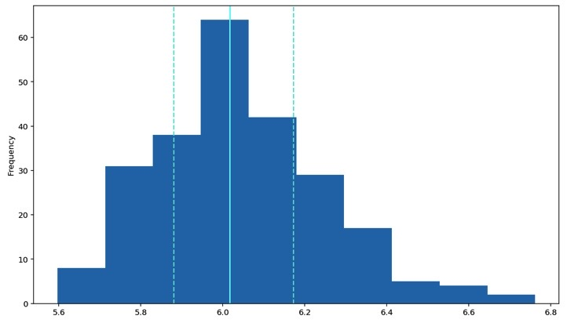

# Exploratory Data Analysis
## Transforming RT distribution
*Since the RT histogram is right skewed it would be hard to perform statistical analysis on it. Many statistical tests assume the histogram is normally distributed and that is why the RT values must be transformed.*

This sample shows a transformed histogram based on the logarithm of the reaction time (rt) values. This is done by:
1) Transforming the RT values
    1. Log-transform the RT values
    2. Add a new column to the dataframe with the log RT values
2) Calling a histogram plot on the log RT column of the dataframe
3) Adding descriptive stats to the graph
    1. Adding dashed lines at the 25th and 75th percentiles
    2. Adding a solid line at the median
4) Calling show( ) to display the graph

```python
df['logrt'] = np.log(df['rt'])

df.logrt.plot(kind= 'hist')

plt.axvline(df['logrt'].describe()['25%'], 0, 1, color='turquoise', linestyle='--')
plt.axvline(df['logrt'].median(), 0, 1, color='cyan', linestyle='-')
plt.axvline(df['logrt'].describe()['75%'], 0, 1, color='turquoise', linestyle='--')

plt.show()
```


